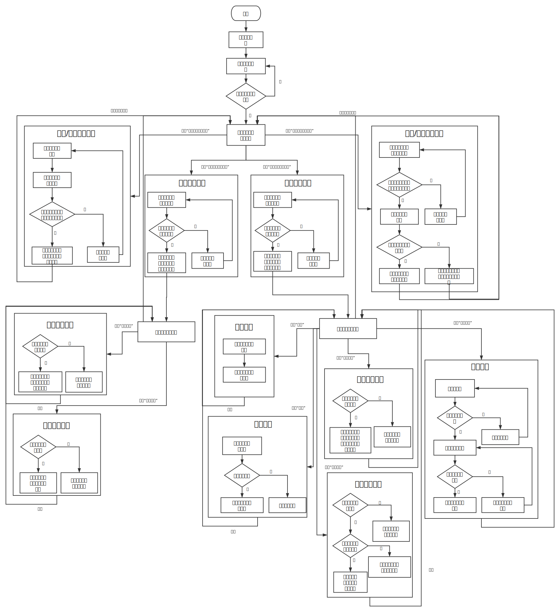

###5. 状态图

状态图

###6. CRC卡

CRC卡——staff_login类

>工作人员登录

|   职责     | 协作者 |
| ---------- | ---   |
| 获得账号、密码 |     |
| 验证身份       |     |
| 账号不存在，提示“账号不存在”       |  staff_account_storage  |
| 密码错误，提示“密码错误”，并给出忘记密码选项| staff_account_storage |
| 验证成功，进入工作人员管理界面 |   |
| 验证失败超过一定次数，则将账号锁定 | staff_account_storage |
| 检查账号是否被锁定 | staff_account_storage |
| 账号被锁定，提示“账号被锁定” |   |

CRC卡——staff_account_storage类

>工作人员账号存储

|   职责     | 协作者 |
| ---------- | ---   |
| 检测账号是否存在 |     |
| 检测账号密码是否与账号对应 |     |
| 返回账号状态（是否被锁定） |     |

CRC卡——securities_account_storage类

>证券账户存储

|   职责     | 协作者 |
| ---------- | ---   |
| 检测账户信息是否存在 |     |
| 检测账户信息是否已挂失 |     |
| 检测账户信息是否已注销 |     |
| 检测账户下所持证券 |     |
| 检测账户下的证券是否被冻结 |     |
| 相关数据修改 |     |

CRC卡——securities_account_create类

>证券账户开设/补办

|   职责     | 协作者 |
| ---------- | ---   |
| 获得证券账户信息 |    |
| 若证券账户不存在，则开设账号 |  securities_account_storage   |
| 若证券账户已挂失，则重新激活账号 |  securities_account_storage   |
| 在证券账户存在且未挂失时报错 |    | 

CRC卡——securities_account_select类

>证券账户查询

|   职责     | 协作者 |
| ---------- | ---   |
| 获得证券账户信息 |    |
| 查询当前证券账户 |  securities_account_storage   |
| 若当前账户不存在或被注销，则给出提示 |   |
| 若当前账户可使用，则给出可进行的操作 |   |

CRC卡——securities_account_manager类

>证券账户管理

|   职责     | 协作者 |
| ---------- | ---   |
| 在证券账户未挂失时挂失证券账户 |  securities_account_storage   |
| 在证券账户未注销时注销该证券账户 |  securities_account_storage   |
| 在证券账户已挂失/注销时报错    |   |

CRC卡——fund_account_storage类

>资金账户存储

|   职责     | 协作者 |
| ---------- | ---   |
| 检测账户信息是否存在 |     |
| 返回卡号 |     |
| 返回资金账户所属证券账户 |     |
| 检测卡号对应的密码 |     |
| 检测账户信息是否已挂失 |     |
| 检测账户信息是否已注销 |     |
| 返回账户剩余资金 |     |
| 检测账户下的资金是否被冻结 |     |
| 相关数据修改 |     |

CRC卡——fund_account_create类

>资金账户开设/补办

|   职责     | 协作者 |
| ---------- | ---   |
| 获得资金账户信息 |     |
| 若资金账户不存在，则开设账号并返回卡号 |  fund_account_storage   |
| 若资金账户已挂失，则重新激活账户及所属证券账户 |  securities_account_storage， fund_account_storage   |
| 在资金账户存在且未挂失时报错 |     |

CRC卡——fund_account_select类

>资金账户查询

|   职责     | 协作者 |
| ---------- | ---   |
| 获得资金账户信息 |    |
| 查询当前资金账户 |  fund_account_manager  |
| 若输入账户不存在或已注销，则给出提示 |    |
| 若输入信息正确，则给出可进行的操作  |    |

CRC卡——fund_account_manager类

>资金账户管理

|     职责   | 协作者 |
| ---------- | ------|
| 在资金账户未挂失时挂失资金账户且冻结证券账户 | securities_account_storage，fund_account_storage |
| 在资金未注销且无剩余资金时注销该资金账户 |  fund_account_storage   |
| 在操作无法进行时报错 | |
| 读取原密码，错误时提示错误 | fund_account_storage |
| 读取新密码，验证两次输入是否正确| |
| 修改为新密码 | fund_account_storage |

CRC卡——fund_manager类

>资金账户下资金管理

|   职责     | 协作者 |
| ---------- | ---   |
| 添加资金 | fund_account_storage |
| 金额足够时取出资金 | fund_account_storage |
| 取出资金、金额不足时提示错误 | |
