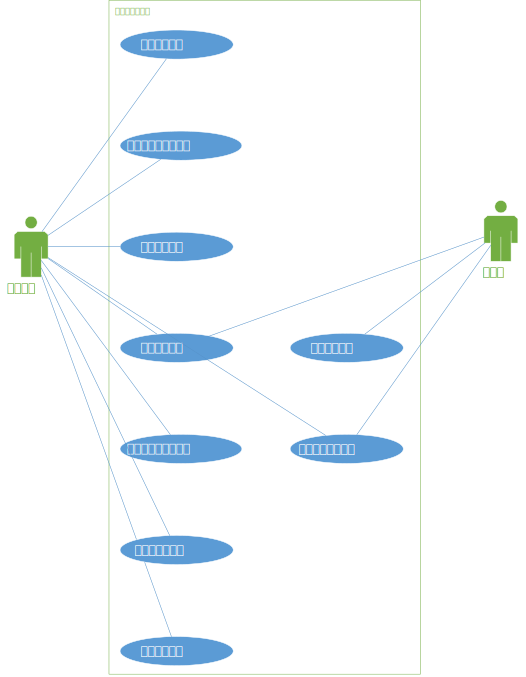

## 2 任务概述

### 2.1 目标
“账户业务子系统”的参与者有三类：工作人员、投资者和交易客户端。账户业务子系统将为这两类参与者实现如下功能：工作人员可以开设证券账户、挂失，补办证券账户、注销证券账户、开设资金账户、添加和取出资金、挂失，补办资金账户、注销资金账户。投资者通过交易客户端可以修改资金账户密码、查询资金账户。
### 2.2 参与者的特点
针对“自动排课子系统”的第一类参与者工作人员，我们考虑到年龄、知识层次、技术水平等方面的因素，假定工作人员没有专业的软件工程与数据库相关知识，但是对账户业务流程本身较为熟悉。因此提供给工作人员的界面会简洁、直观、易于操作，信息呈现尽可能简洁明了。 

针对交易客户端，提供可维护性高、扩展性高的接口进行数据通信。

### 2.3 假定与约束

《股票交易系统》分为账户业务、信息发布、交易客户端、中央交易系统、交易系统管理等五个子系统。五大系统均由同学们分组独立开发完成，没有经费划拨，因此利用现有资源高效地开发出符合需求的系统。此外，还要加强团队沟通，以确保系统的可用性。由于本着实验目的，因此《股票交易系统》并没有提出很高的性能要求。

## 3 用户场景

### 3.1 用例

#### 用例1：开设证券账户

- 迭代： 1。 最新更改记录：闫徐天任， 2018年5月26日
- 主参与者：工作人员。
- 情境目标： 为符合要求的个人投资者或法人投资者开设证券账户。
- 前提条件：工作人员必须拥有操作权限。 
- 触发器：有个人投资者或法人投资者携带了齐全的材料到服务前台提出开设证券账户。
- 场景：
  1. 投资者将各种材料交给工作人员，工作人员审核材料，提出开设证券账户的请求。
  2. 工作人员进入管理系统。
  3. 系统显示所有主要功能按钮。
  4. 工作人员在“工作人员管理界面”选择“开设证券账户”功能。
  5. 工作人员选择证券账户类型。
  6. 工作人员录入前来办理业务的投资者填写的表格信息。
  7. ​工作人员点击“开设账户”按钮。
- 异常处理：
  1. 工作人员没有操作权限——需要工作人员登录管理界面。
  2. 投资者没有开设证券账户的资格——本系统不考虑该异常，假定工作人员已经进行了人工审核。
  3. 投资者已经开设过证券账户——系统显示“该账户已存在”的错误提示。
- 优先级：基础功能，必须被实现。
- 何时有效：首次增量。
- 使用频率：一般。
- 使用方式：通过浏览器。
- 次要参与者：暂无
- 次要参与者的连接渠道：暂无
- 未解决的问题：暂无

#### 用例2：挂失证券账户

- 主参与者：工作人员。
- 情境目标： 为有需要的个人投资者或法人投资者挂失证券账户。
- 前提条件：工作人员必须拥有操作权限。 
- 触发器：有个人投资者或法人投资者携带了齐全的材料到服务前台提出挂失证券账户。
- 场景：
  1. 投资者将各种材料交给工作人员，工作人员审核材料，提出挂失要求。
  2. 工作人员进入管理系统。
  3. 系统显示所有主要功能按钮。
  4. 工作人员选择“查询证券账户”功能。
  5. 工作人员根据前来办理业务的投资者提供的材料查询证券账户。
  6. 系统返回找到的证券账户，显示可以进行的操作。
  7. 工作人员点击“挂失账户”按钮。
- 异常处理：
  1. 工作人员没有操作权限——需要工作人员登录管理界面。
  2. 证券账户不存在或被注销——系统显示“操作失败，账户不存在”的错误提示。
  3. 该证券账户已经处于挂失状态——系统显示“该账户已被挂失”的错误提示。
- 优先级：基础功能，必须被实现。
- 何时有效：首次增量。
- 使用频率：较低。
- 使用方式：通过浏览器。
- 次要参与者：暂无
- 次要参与者的连接渠道：暂无
- 未解决的问题：暂无

#### 用例3：补办证券账户

- 迭代： 1。 最新更改记录：闫徐天任， 2018年5月26日
- 主参与者：工作人员。
- 情境目标： 为证券账户已挂失的投资者补办证券账户。
- 前提条件：工作人员必须拥有操作权限。 
- 触发器：有个人投资者或法人投资者携带了齐全的材料到服务前台提出补办证券账户。
- 场景：
  1. 投资者将各种材料交给工作人员，工作人员审核材料，提出补办证券账户的请求。
  2. 工作人员进入管理系统。
  3. 系统显示所有主要功能按钮。
  4. 工作人员在“工作人员管理界面”选择“开设证券账户”功能。
  5. 工作人员选择证券账户类型。
  6. 工作人员录入前来办理业务的投资者填写的表格信息。
  7. ​工作人员点击“开设账户”按钮。
- 异常处理：
  1. 工作人员没有操作权限——需要工作人员登录管理界面。
  2. 投资者失去了开设证券账户的资格——本系统不考虑该异常，假定工作人员已经进行了人工审核。
  3. 投资者已经存在的证券账户不处于挂失状态——系统显示“补办失败”的错误提示。
- 优先级：基础功能，必须被实现。
- 何时有效：首次增量。
- 使用频率：一般。
- 使用方式：通过浏览器。
- 次要参与者：暂无
- 次要参与者的连接渠道：暂无
- 未解决的问题：如何原证券账户的资金账户进行关联？

#### 用例4：注销证券账户

- 主参与者：工作人员。
- 情境目标： 为有需要的个人投资者或法人投资者注销证券账户。
- 前提条件：工作人员必须拥有操作权限。 
- 触发器：有个人投资者或法人投资者携带了齐全的材料到服务前台提出注销证券账户。
- 场景：
  1. 投资者将各种材料交给工作人员，工作人员审核材料，提出注销要求。
  2. 工作人员进入管理系统。
  3. 系统显示所有主要功能按钮。
  4. 工作人员选择“查询证券账户”功能。
  5. 工作人员根据前来办理业务的投资者提供的材料查询证券账户。
  6. 系统返回找到的证券账户，显示可以进行的操作。
  7. 工作人员点击“注销账户”按钮。
- 异常处理：
  1. 工作人员没有操作权限——需要工作人员登录管理界面。
  2. 证券账户不存在——系统显示“操作失败，账户不存在”的错误提示。
  3. 该证券账户已经被注销——系统显示“该账户已被注销”的错误提示。
- 优先级：基础功能，必须被实现。
- 何时有效：首次增量。
- 使用频率：很低。
- 使用方式：通过浏览器。
- 次要参与者：暂无
- 次要参与者的连接渠道：暂无
- 未解决的问题：暂无

#### 用例5：开设资金账户

- 迭代： 1。 最新更改记录：闫徐天任， 2018年5月26日
- 主参与者：工作人员。
- 情境目标： 为符合要求的证券账户开设资金账户。
- 前提条件：工作人员必须拥有操作权限。 
- 触发器：有证券账户携带了齐全的材料到服务前台提出开设资金账户。
- 场景：
  1. 证券账户投资者将各种材料交给工作人员，提出开设资金账户的请求。工作人员审核材料。
  2. 工作人员进入管理系统。
  3. 系统显示所有主要功能按钮。
  4. 工作人员在“工作人员管理界面”选择“开设资金账户”功能。
  5. 系统显示一个表单。
  6. 工作人员为证券账户录入资金账户信息。
  7. 系统弹出设置密码的界面。
  8. 证券账户设置密码。
  9. 工作人员点击“开设资金账户”按钮。
  10. 系统返回一个卡号。
- 异常处理：
  1. 工作人员没有操作权限——需要工作人员登录管理界面。
  2. 该证券账户已经开设过资金账户——系统显示“该账户已存在”的错误提示。
- 优先级：基础功能，必须被实现。
- 何时有效：首次增量。
- 使用频率：一般。
- 使用方式：通过浏览器。
- 次要参与者：证券账户。
- 次要参与者的连接渠道：通过浏览器。
- 未解决的问题：证券账户设置资金账户密码时，不应该让工作人员看见。

#### 用例6：挂失资金账户

- 主参与者：工作人员。
- 情境目标： 为有需要的证券账户挂失资金账户。
- 前提条件：工作人员必须拥有操作权限。 
- 触发器：有证券账户携带了齐全的材料到服务前台提出挂失资金账户。
- 场景：
  1. 证券账户各种材料交给工作人员，提出挂失要求，工作人员审核材料。
  2. 工作人员进入管理系统。
  3. 系统显示所有主要功能按钮。
  4. 工作人员选择“查询资金账户”功能。
  5. 工作人员根据前来办理业务的投资者提供的材料查询资金账户。
  6. 系统返回找到的资金账户，显示可以进行的操作。
  7. 工作人员点击“挂失账户”按钮。
  8. 系统显示“资金账户以被注销”的提示。
  9. 系统将该资金账户的资金冻结，将该证券账户下所有的证券予以冻结。
- 异常处理：
  1. 工作人员没有操作权限——需要工作人员登录管理界面。
  2. 证券账户不存在或被注销——系统显示“操作失败，账户不存在”的错误提示。
  3. 该资金账户已经处于挂失状态——系统显示“该账户已被挂失”的错误提示。
- 优先级：基础功能，必须被实现。
- 何时有效：首次增量。
- 使用频率：较低。
- 使用方式：通过浏览器。
- 次要参与者：暂无
- 次要参与者的连接渠道：暂无
- 未解决的问题：暂无

#### 用例7：补办资金账户

- 迭代： 1。 最新更改记录：闫徐天任， 2018年5月27日
- 主参与者：工作人员。
- 情境目标： 为资金账户已挂失的投资者补办资金账户。
- 前提条件：工作人员必须拥有操作权限。 
- 触发器：有证券账户携带了齐全的材料到服务前台提出补办资金账户。
- 场景：
  1. 投资者将各种材料交给工作人员，工作人员审核材料，提出补办资金账户的请求。
  2. 工作人员进入管理系统。
  3. 系统显示所有主要功能按钮。
  4. 工作人员在“工作人员管理界面”选择“开设资金账户”功能。
  5. 系统显示一个表单。
  6. 工作人员为证券账户录入资金账户信息。
  7. 系统弹出设置密码的界面。
  8. 证券账户设置密码。
  9. 工作人员点击“开设资金账户”按钮。
  10. 系统返回一个卡号。
  11. 系统将新建的资金账户与证券账户关联。
  12. 系统将资金和证券帐号重新激活。
- 异常处理：
  1. 工作人员没有操作权限——需要工作人员登录管理界面。
  2. 该证券账户已经开设过资金账户——系统显示“该账户已存在”的错误提示。
- 优先级：基础功能，必须被实现。
- 何时有效：首次增量。
- 使用频率：一般。
- 使用方式：通过浏览器。
- 次要参与者：证券账户。
- 次要参与者的连接渠道：通过浏览器。
- 未解决的问题：证券账户设置资金账户密码时，不应该让工作人员看见。

#### 用例8：资金账户销户

- 主参与者：工作人员。
- 情境目标： 为有需要的个人投资者或法人投资者注销证券账户。
- 前提条件：工作人员必须拥有操作权限。投资者必须已经取出帐户内的所有现金。
- 触发器：投资者想要更换证券经纪商，因此想对资金账户进行销户。
- 场景：
  1. 投资者将各种材料交给工作人员，工作人员审核材料，提出注销要求。
  2. 工作人员进入管理系统。
  3. 系统显示所有主要功能按钮。
  4. 工作人员选择“查询证券账户”功能。
  5. 工作人员根据前来办理业务的投资者提供的材料查询证券账户。
  6. 系统返回找到的证券账户，显示可以进行的操作。
  7. 工作人员点击“注销账户”按钮。
- 异常处理：
  1. 工作人员没有操作权限——需要工作人员登录管理界面。
  2. 资金账户中还有剩余资金——系统显示“还有剩余资金，操作失败”的错误提示。
  3. 证券账户不存在——系统显示“操作失败，账户不存在”的错误提示。
  4. 该资金账户已经被注销——系统显示“该账户已被注销”的错误提示。
- 优先级：基础功能，必须被实现。
- 何时有效：首次增量。
- 使用频率：很低。
- 使用方式：通过浏览器。
- 次要参与者：暂无
- 次要参与者的连接渠道：暂无
- 未解决的问题：暂无

#### 用例9：查询资金账户

- 主参与者：投资者。
- 情境目标： 投资者通过交易客户端查看资金账户内的资金信息。
- 前提条件：交易客户端已实现该查询功能，并能与账户业务子系统进行数据交互。
- 触发器：投资者在交易客户端界面点击了资金信息查询功能。
- 场景：
  1. 投资者交易客户端界面点击了资金信息查询功能。
  2. 交易客户端向本系统查询该资金账户。
  3. 本系统查询数据库后返回序列化的资金账户信息。
- 异常处理：暂无
- 优先级：基础功能，必须被实现。
- 何时有效：首次增量。
- 使用频率：较高。
- 使用方式：通过交易客户端。
- 次要参与者：交易客户端
- 次要参与者的连接渠道：网络连接
- 未解决的问题：
  1. 通过何种协议进行数据交换？
  2. 证券账户、资金账户等数据储存在哪？

#### 用例10：添加和取出资金

- 主参与者：工作人员。
- 情境目标： 为资金账户添加或取出资金。
- 前提条件：工作人员必须拥有操作权限。 
- 触发器：有资金账户携带了齐全的材料到服务前台提出添加或取出资金。
- 场景：
  1. 证券账户各种材料交给工作人员，提出添加或取出资金的要求。
  2. 工作人员进入管理系统。
  3. 系统显示所有主要功能按钮。
  4. 工作人员选择“查询资金账户”功能。
  5. 工作人员根据前来办理业务的投资者提供的材料查询资金账户。
  6. 系统返回找到的资金账户，显示可以进行的操作。
  7. 工作人员点击“添加”或“取出”按钮。
  8. 系统弹出对话框。
  9. 工作人员输入金额。
- 异常处理：
  1. 工作人员没有操作权限——需要工作人员登录管理界面。
  2. 资金账户余额不足——系统弹出”余额不足“的错误提示。
- 优先级：基础功能，必须被实现。
- 何时有效：首次增量。
- 使用频率：较高。
- 使用方式：通过浏览器。
- 次要参与者：暂无
- 次要参与者的连接渠道：暂无
- 未解决的问题：暂无

#### 用例11：修改资金账户密码（前台）

- 主参与者：投资者。
- 情境目标： 资金账户修改密码。
- 前提条件：工作人员必须拥有操作权限。 
- 触发器：有资金账户携带了齐全的材料到服务前台提出求改密码。
- 场景：
  1. 证券账户各种材料交给工作人员，提出修改密码的要求。
  2. 工作人员进入管理系统。
  3. 系统显示所有主要功能按钮。
  4. 工作人员选择“查询资金账户”功能。
  5. 工作人员根据前来办理业务的投资者提供的材料查询资金账户。
  6. 系统返回找到的资金账户，显示可以进行的操作。
  7. 工作人员点击“修改密码”按钮。
  8. 系统弹出对话框。
  9. 投资者输入原密码。
  10. 系统进行确认。
  11. 投资者输入新密码。
  12. 投资者再次输入新密码。
  13. 系统更新密码。
- 异常处理：
  1. 工作人员没有操作权限——需要工作人员登录管理界面。
  2. 投资者原密码输入错误——系统弹出错误提示。
  3. 投资者中断了修改密码的操作——系统返回，保持原密码不变。
  4. 投资者两次新密码输入不一致——系统弹出错误提示。
- 优先级：基础功能，必须被实现。
- 何时有效：首次增量。
- 使用频率：较低。
- 使用方式：通过浏览器。
- 次要参与者：工作人员。
- 次要参与者的连接渠道：通过浏览器。
- 未解决的问题：证券账户设置资金账户密码时，不应该让工作人员看见。

####用例12：修改资金账户密码（交易客户端）

- 情境目标： 投资者通过交易客户端修改资金账户密码。
- 前提条件：交易客户端已实现该查询功能，并能与账户业务子系统进行数据交互。
- 触发器：投资者在交易客户端界面点击了修改密码功能。
- 场景：
  1. 投资者交易客户端界面点击了点击了修改密码功能。
  2. 交易客户端向本系统查询该资金账户原密码。
  3. 本系统查询数据库后返回序列化的资金账户原密码。
  4. 交易客户端向本系统发送新密码。
  5. 本系统更新数据库。
  6. 本系统返回操作成功的信息。
- 异常处理：参照用例11

- 优先级：基础功能，必须被实现。
- 何时有效：首次增量。
- 使用频率：较高。
- 使用方式：通过交易客户端。
- 次要参与者：交易客户端
- 次要参与者的连接渠道：网络连接
- 未解决的问题：
  1. 通过何种协议进行数据交换？
  2. 证券账户、资金账户等数据储存在哪？

### 3.2 用例图

